# TaskManagerApp

## Overview

TaskManagerApp is a web-based task management application developed using **Blazor WebAssembly** for the frontend, **ASP.NET Core Web API** for the backend, and **MySQL** for the database. This application is designed to help users efficiently organize, prioritize, and manage their tasks.

## Features

- **User Authentication**:
  - **Signup Page**: Register a new account.
    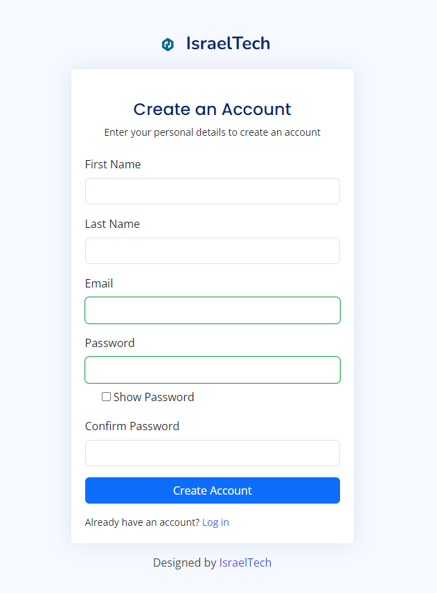
  - **Login Page**: Securely log in to your account.
    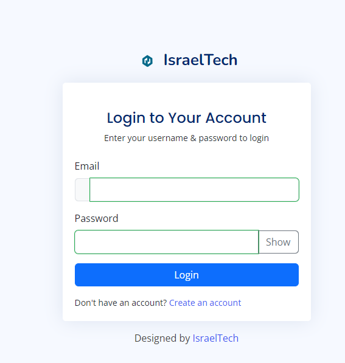

- **Task Management**:
  - **Create Tasks**: Add new tasks with a task avatar image, name, date, status, and priority.
    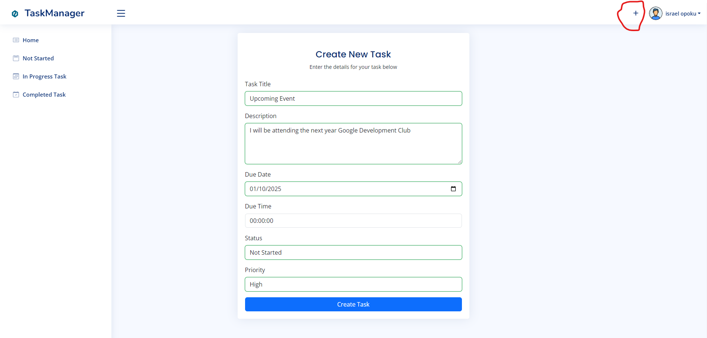
  - **Edit Tasks**: Modify existing task details.
    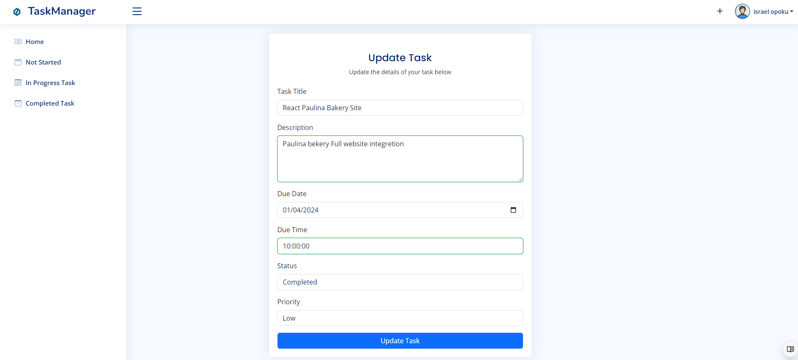
    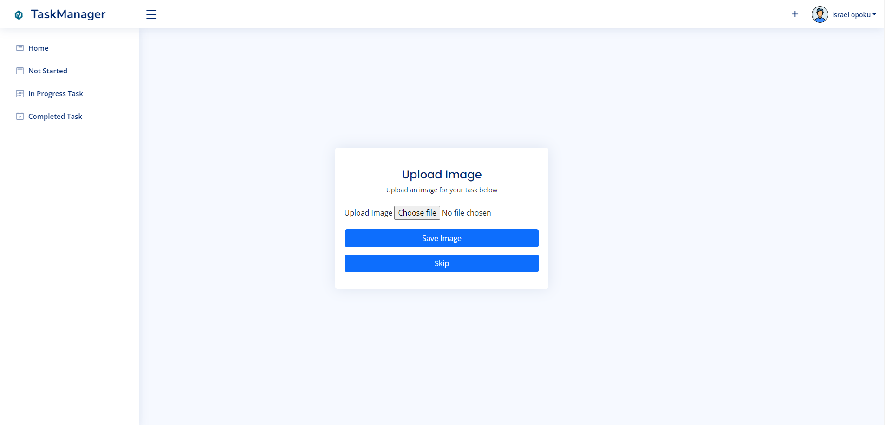
  - **Mark as Completed**: Change the task status to "Completed."
    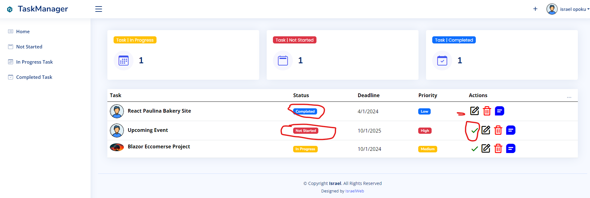
  - **View Description**: Access detailed information about each task.
    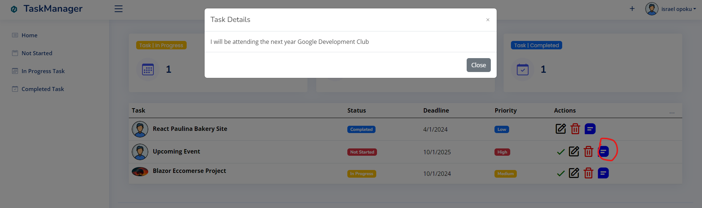
  - **Delete Tasks**: Remove tasks that are no longer needed.
    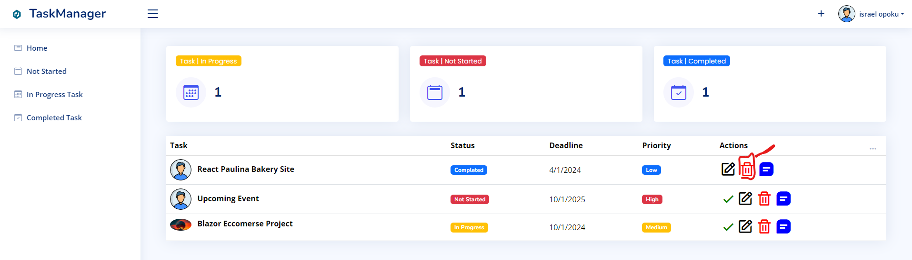

- **Task Overview**:
  - **Task Count Section**: View the count of tasks categorized by their status:
    - Not Started
    - In Progress
    - Completed
    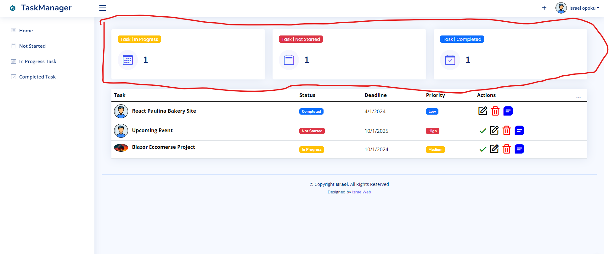
  - **Task Status Views**: Filter tasks based on their status (Not Started, In Progress, Completed).
    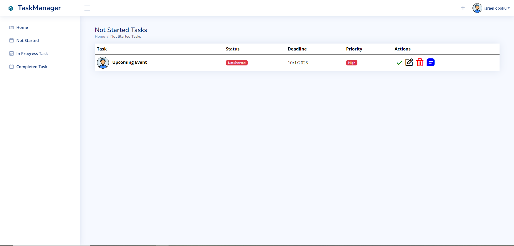
    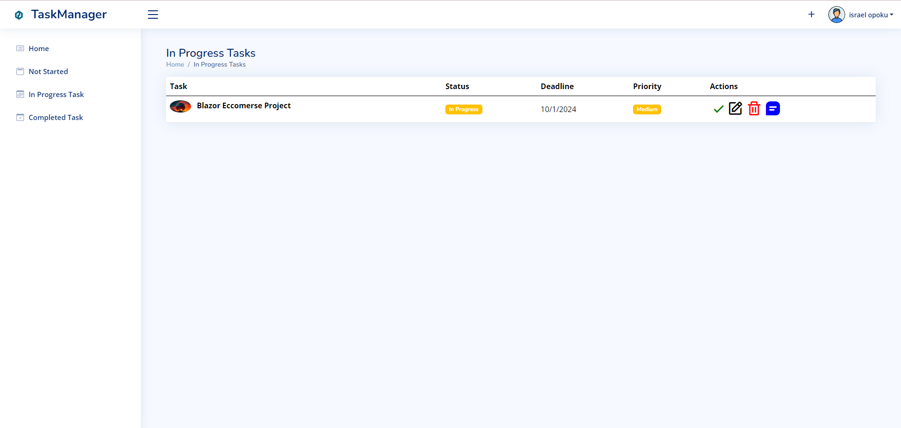
    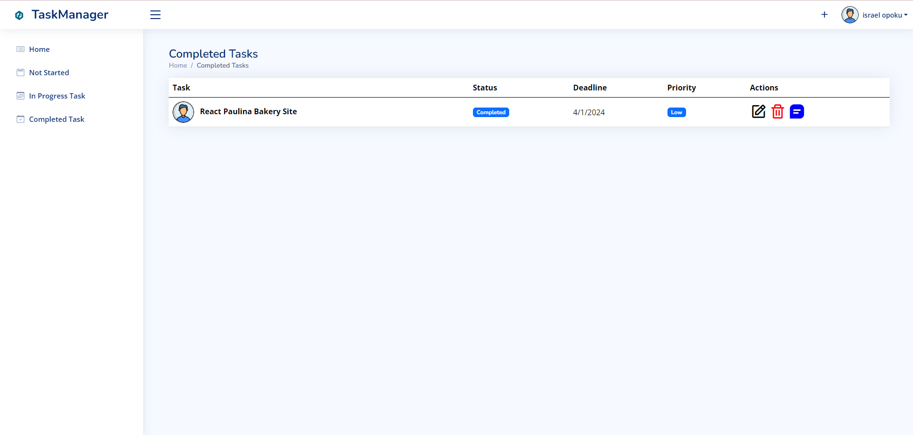

- **Profile Settings**: Update personal information including First Name, Last Name, Email, and Profile Picture.
  )
  )
  )
  )

  

## Technology Stack

- **Frontend**: Blazor WebAssembly
- **Backend**: ASP.NET Core Web API
- **Database**: MySQL

## Getting Started

### Prerequisites

- [.NET SDK](https://dotnet.microsoft.com/download) (for building and running the ASP.NET API)
- [MySQL Server](https://dev.mysql.com/downloads/mysql/) (for the database)
- [MySQL Workbench](https://dev.mysql.com/downloads/workbench/) (optional, for database management)
- [Visual Studio](https://visualstudio.microsoft.com/) or [Visual Studio Code](https://code.visualstudio.com/) (for development)
- A modern web browser (Chrome, Firefox, Edge, etc.)

### Installation

1. **Clone the Repository**

   ```bash
   git clone https://github.com/yourusername/TaskManagerApp.git
   cd TaskManagerApp
